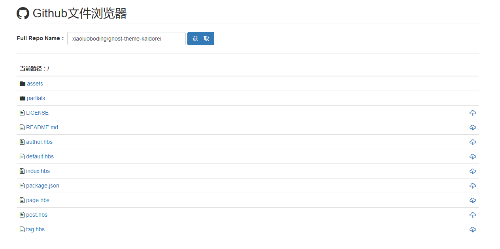

# github-file-explorer

> A demo of Vue.js project. See [Demo](http://xiaoluoboding.github.io/vue-demo-collection/github-file-explorer/)

## Build Setup

``` bash
# serve with hot reload at localhost:8090
npm run github-file-explorer
```

## Preview



For detailed explanation on how things work, consult the [docs for vue-loader](http://vuejs.github.io/vue-loader).
